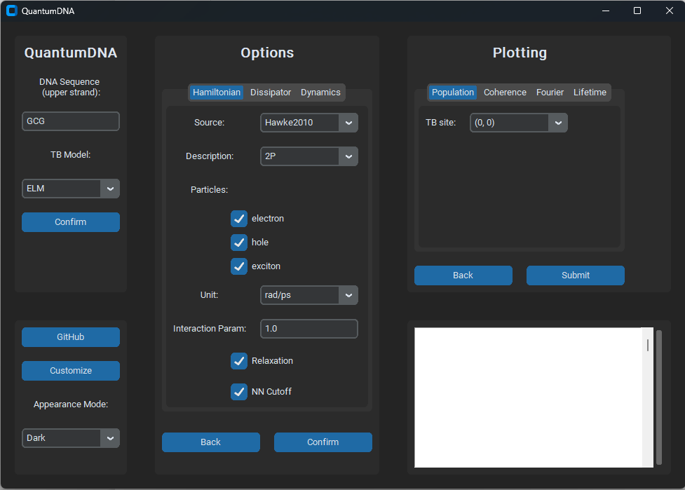
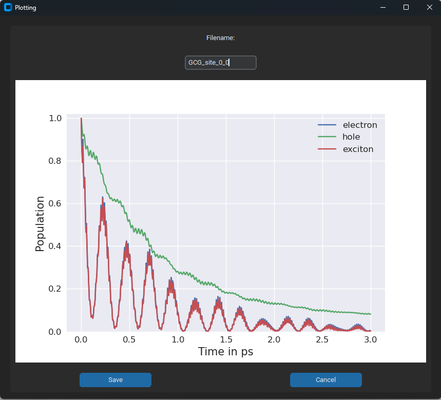
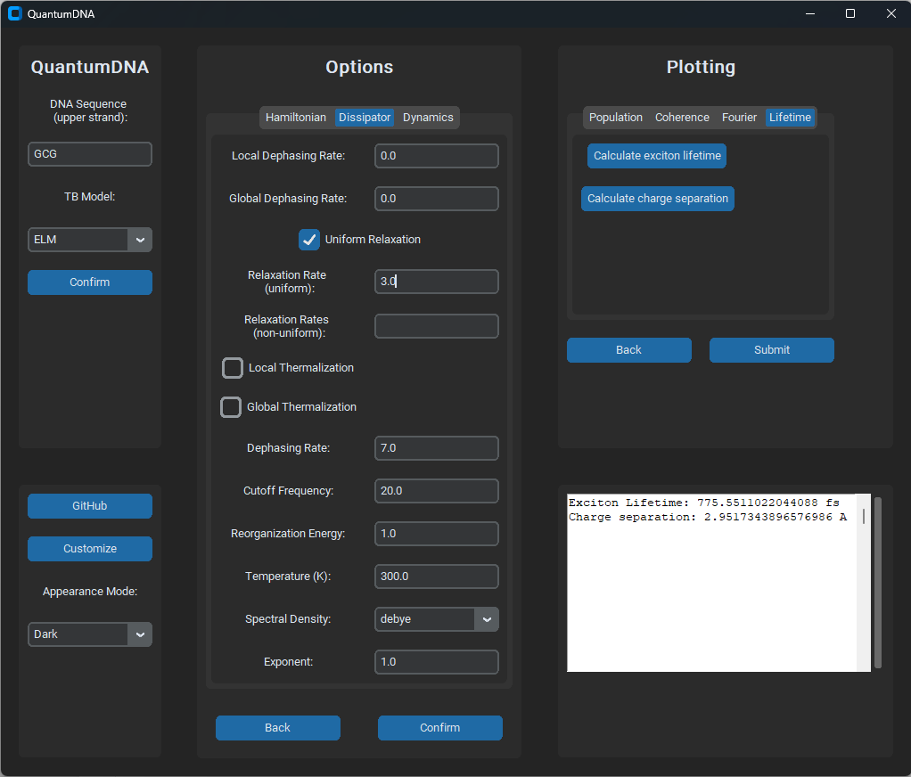

<p align="center">
    
</p>
<p align="center">
    <a href="https://opensource.org/licenses/BSD-3-Clause">
        </a>
    <a href="https://doi.org/10.5281/zenodo.12734026">
        </a>
    <a href="https://quantumdna.readthedocs.io/en/latest/?badge=latest">
        </a>
    <a href="https://github.com/dehe1011/QuantumDNA/releases">
        </a>
    <a href='https://coveralls.io/github/dehe1011/QuantumDNA?branch=main'>
        </a>
</p>

---

# QuantumDNA

**Author: [Dennis Herb](https://github.com/dehe1011)**

This Python package can be cited as:

> *QuantumDNA (github.com/dehe1011/QuantumDNA)*, D. Herb, 2024, DOI: [10.5281/zenodo.12734027](https://doi.org/10.5281/zenodo.12734027)

## What's new

**July 2024**

* Added a graphical user interface (GUI) to the package such that it is easily accessible for users who are less familiar with computer science. The user interface is based on the [customtkinter](https://customtkinter.tomschimansky.com/) package by Tom Schimansky. 
* Added a Jupyter Notebook ```QuantumDNA/docs/tutorials/3_Paper.ipynb``` that reproduces all figures contained in our paper (and the supplementary) [D. Herb, M. Rossini and J. Ankerhold, *Physical Review E 109*, 064413 (2024).](https://doi.org/10.1103/PhysRevE.109.064413)
* Added a [documentation](https://quantumdna.readthedocs.io/en/latest/) available on Read the Docs 


## Introduction

Welcome to QuantumDNA, a powerful and flexible tool designed to calculate lifetimes, average charge separation, and dipole moments of excited states along DNA. Leveraging the formalism of open quantum systems and based on tight-binding Hamiltonians, QuantumDNA is equipped to handle various tight-binding models. Users can incorporate custom tight-binding parameters from ab initio calculations or experimental data, as well as define their own models, making the tool highly adaptable. QuantumDNA is regularly updated to ensure it remains at the cutting edge and includes a user-friendly interface to be accessible even to researchers less familiar with computer science. Results from several research papers can be reproduced with QuantumDNA.

### Key Features

* Versatile Calculations: Calculate lifetimes, charge separation, and dipole moments.
* Customizable Models: Add and use custom tight-binding parameters and models.
* User-Friendly Interface: Designed for ease of use by all researchers.
* Parallelization: Supports parallel computing for the calculation of excited state properties for large ensembles of DNA sequences, optimizing performance within the computationally intensive context of open quantum systems.
* Regular Updates: Stay current with the latest advancements and improvements.

## Getting started 

### Quick Installation

For a quick installation, you can install the `qDNA` package using pip within a virtual environment:

```pip install qDNA```

To ensure compatibility and avoid conflicts with other packages, we recommend using a virtual environment. For detailed installation instructions and alternative methods, please refer to the [Installation Guide](installation.md).

### Example Program

To test QuantumDNA, you can run the following simple example where the exciton lifetime and the average charge separation of a double-stranded GCG DNA sequence are calculated. You can try different sequences, tight-binding models, and keyword arguments to investigate how these factors affect the exciton lifetime and average charge separation. For example, you might find that in general more uniform sequences show higher values. Do you know the reason for this observation? 

```python

from qDNA import calc_lifetime, calc_dipole

# input
upper_strand = 'GCG'
tb_model_name = 'ELM'
kwargs = dict(unit='rad/ps', relax_rate=3, source='Hawke2010')

# calculation 
lifetime = calc_lifetime(upper_strand, tb_model_name, **kwargs)
dipole = calc_dipole(upper_strand, tb_model_name, **kwargs)

# output 
print(f"Exciton lifetime {lifetime} fs")
print(f"Average charge separation {dipole} A")
```


## Documentation

The documentation for the [latest release](https://quantumdna.readthedocs.io/en/latest/) is available for reading on Read The Docs. The [package website](https://dehe1011.github.io/QuantumDNA/) contains general information about the project and planned future developments. 

### Tutorials

The code contains some tutorials and demonstrations to better understand and explore the functionalities. 

In the `QuantumDNA/docs/tutorials` folder you can find the notebook **3_Paper.ipynb** that contains and reproduces all the figures contained in [D. Herb, M. Rossini and J. Ankerhold, Ultrafast excitonic dynamics in DNA: Bridging correlated quantum dynamics and sequence dependence.](https://arxiv.org/abs/2402.16892)

Additionally, the `QuantumDNA/docs/tutorials` folder contains the following tutorials:

* **0_TB_Model.ipynb**: tutorials on predefined and custom tight-binding models.
* **1_Plotting_Routines.ipynb**: tutorial on the predefined plotting routines.
* **2_Open_System.ipynb**: tutorial on different ways to treat DNA relaxation in the DNA environment.
* **Exploration_Notebook.ipynb**: A place to test the functionality of individual functions isolated from the rest of the code.

These tutorials provide hands-on examples and explanations to help you effectively use the `qDNA` package.


### Graphical user interface

The `qDNA` package includes a graphical user interface (GUI) that provides an intuitive and user-friendly way to interact with the package's functionalities. You can access the GUI with the following code:

```python

from qDNA.gui import qDNA_app

app = qDNA_app()
app.mainloop()
```

The GUI allows you to easily explore and utilize the capabilities of the `qDNA` package. Below are some examples demonstrating its use:

* **Menu Window:** Access various functionalities from a centralized menu.*


> _Screenshot of the menu of the user interface._

* **Plot Generation:** Create plots effortlessly by submitting your parameters through the GUI.


> _Plot obtained after pressing the submit button on the menu (see image above)._

* **Calculation Display:** Perform calculations, such as exciton lifetime and average charge separation, and view the results directly within the interface.


> _Screenshot of the menu of the user interface with calculations of the exciton lifetime and average charge separation displayed in the frame on the bottom right._

The GUI streamlines the process of working with `qDNA`, making it accessible even to those who may not be familiar with coding. Whether you're generating plots or calculating complex dynamics, the GUI provides a convenient and efficient way to achieve your goals.


### Shortcuts

To enhance the readability and maintainability of the code, we have standardized a set of frequently used shortcuts. These abbreviations help keep the code concise while still being clear and understandable:

* ham: hamiltonian
* dm: density matrix
* tb: tight-binding
* eigv: eigenvalue/ eigenenergy
* eigs: eigenstates/ eigenvectors
* dim: dimension
* fig: figure
* op: operator
* loc: local
* glob: global
* deph: dephasing
* therm: thermalizing
* seq: sequence
* calc: calculate


## References

Papers from our group:

* [R. Siebert, O. Ammerpohl, M. Rossini et al. A quantum physics layer of epigenetics: a hypothesis deduced from charge transfer and chirality-induced spin selectivity of DNA. *Clin Epigenet 15*, 145 (2023).](https://doi.org/10.1186/s13148-023-01560-3)
* [D. Herb, M. Rossini and J. Ankerhold, Ultrafast excitonic dynamics in DNA: Bridging correlated quantum dynamics and sequence dependence. *Physical Review E 109*, 064413 (2024).](https://doi.org/10.1103/PhysRevE.109.064413)

Tight-binding parameters:

* [L.G.D. Hawke, G. Kalosakas and C. Simserides, Electronic parameters for charge transfer along DNA. *The European Physical Journal E 32*, 291 (2010)](https://doi.org/10.1140/EPJE/I2010-10650-Y)
* [C. Simserides, A systematic study of electron or hole transfer along DNA dimers, trimers and polymers. *Chemical Physics 440*, 31 (2014)](https://doi.org/10.1016/j.chemphys.2014.05.024)
* [M. Mantela, C. Simserides and R. Di Felice, LCAO electronic structure of nucleic acid bases and other heterocycles and transfer integrals in B-DNA, including structural variability. *Materials 14*, 4930 (2021)](https://doi.org/10.3390/ma14174930)

Tight-binding models:

* [K. Lambropoulos and C. Simserides, Tight-binding modeling of nucleic acid sequences: Interplay between various types of order or disorder and charge transport. *Symmetry 11*, 968 (2019)](https://doi.org/10.3390/sym11080968)

Excitons and electron-hole Coulomb interaction:

* [C. Crespo-Hernandez, B. Cohen and B. Kohler, Base stacking controls excited-state dynamics in A·T DNA. *Nature 436*, 1141 (2005)](https://doi.org/10.1038/nature03933)
* [E.R. Bittner, Lattice theory of ultrafast excitonic and charge-transfer dynamics in DNA. *Journal of Chemical Physics 125*, 094909 (2006)](https://doi.org/10.1063/1.2335452)
* [E.M. Conwell, P.M. McLaughlin and S.M. Bloch, Charge-Transfer Excitons in DNA. *The Journal of Physical Chemistry B 112*, 2268 (2008)](https://doi.org/10.1021/jp077344x)
* [S. Tornow, R. Bulla, F.B. Anders and G. Zwicknagl, Multiple-charge transfer and trapping in DNA dimers. *Physical Review B 82*, 195106 (2010)](https://doi.org/10.1103/PhysRevB.82.195106)

The biological relevance of DNA charge transfer:

* [J.C. Genereux and J.K. Barton, Mechanisms for  DNA charge transport. *Chemical Reviews 110*, 1642 (2010)](https://doi.org/10.1021/cr900228f)
* [A.R. Arnold, M.A. Grodick and J.K. Barton, DNA Charge Transport: from Chemical Principles to the Cell. *Cell Chemical Biology 23*, 183 (2016)](https://doi.org/10.1016/j.chembiol.2015.11.010)

Simulation of open quantum systems:

* [J.R. Johansson, P.D. Nation and Franco Nori, QuTiP: An open-source Python framework for the dynamics of open quantum systems. *Computer Physics Communications 183*, 1760 (2012)](https://doi.org/10.1016/j.cpc.2012.02.021)
* [quantum_HEOM (github.com/jwa7/quantum_HEOM), J.W. Abbott, 2022](https://doi.org/10.5281/zenodo.7230160)


## Support

For support, please contact the author at dennis.herb@uni-ulm.de.
