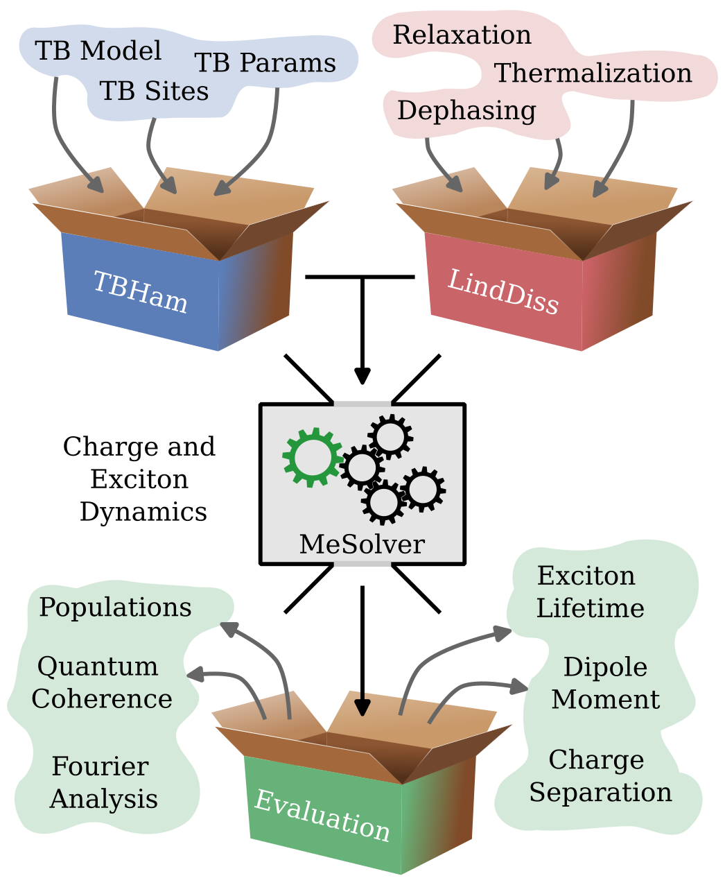
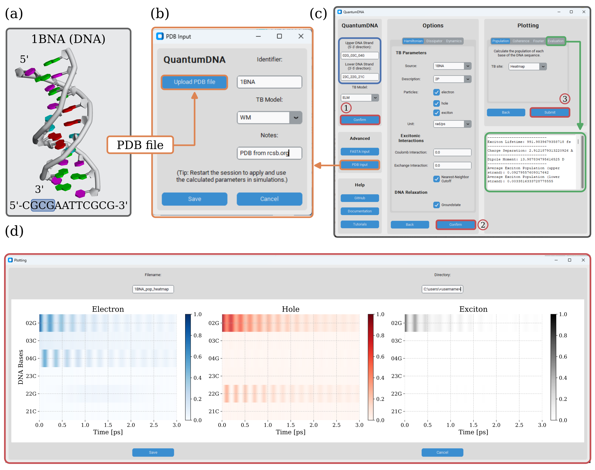
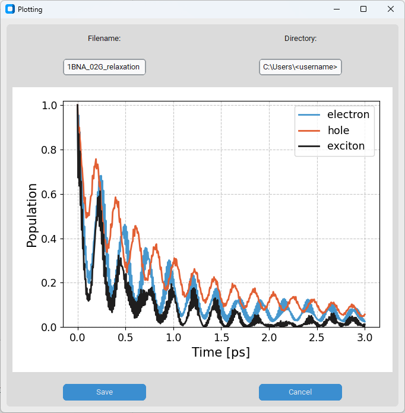
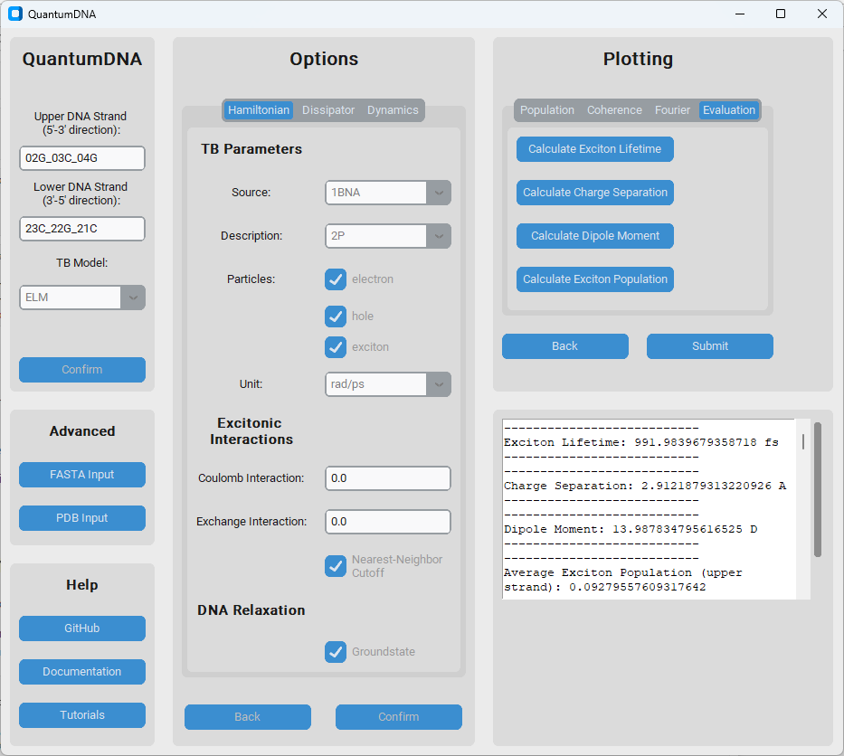

<p align="center">
    
</p>

<p align="center">
    <a href="https://opensource.org/licenses/BSD-3-Clause">
        </a>
    <a href="https://doi.org/10.5281/zenodo.12734026">
        </a>
    <a href="https://quantumdna.readthedocs.io/en/latest/?badge=latest">
        </a>
    <a href="https://github.com/dehe1011/QuantumDNA/releases">
        </a>
    <a href="https://pypi.org/project/qDNA/">
    </a>
    <!--
    <a href='https://coveralls.io/github/dehe1011/QuantumDNA?branch=main'>
        </a>
    -->
    <a href='https://github.com/dehe1011/QuantumDNA/actions/workflows/code-quality.yml'>
        </a>
    <a href='https://github.com/psf/black'>
        </a>
</p>

---

# Welcome to QuantumDNA

**Author: [Dennis Herb](https://github.com/dehe1011)**

This Python package can be cited as:

> *QuantumDNA (github.com/dehe1011/QuantumDNA)*, D. Herb, 2024, DOI: [10.5281/zenodo.12734027](https://doi.org/10.5281/zenodo.12734027)

## Introduction

QuantumDNA is an open-source Python package for simulating charge transfer (CT) and excited states in DNA. These processes are key to understanding how DNA maintains genetic stability, how mutations occur, and even how we can use DNA in nanotechnology. QuantumDNA combines powerful quantum physics models like Linear Combination of Atomic Orbitals (LCAO) and tight-binding (TB) with quantum master equations to handle environmental effects. This makes it possible to analyze large DNA datasets quickly and accurately, uncovering insights into genetic and epigenetic phenomena. QuantumDNA comes with a clean and simple graphical user interface (GUI)—perfect for researchers and students, even without extensive coding experience.

Whether you're a scientist, student, or just curious, QuantumDNA is here to help you explore the fascinating world of DNA charge transfer. Dive in and start exploring today!

<p align="center">
    
</p>

### Key Features

* Graphical User Interface (GUI): Intuitive and user-friendly interface, making the tool accessible to researchers and students with limited programming experience.
* Parallelized Calculations: Optimized for performance, enabling the analysis of large DNA ensembles with efficient computational resource utilization.
* Integration with Publicly Accessible Databases: Supports input geometries from widely used DNA structure databases.
* Unified Framework: Provides a reproducible platform for simulating and comparing results from different scientific papers and methodologies.
* Open-Source: Fully open-source and extensible, allowing users to modify and adapt the code to suit their specific research needs.
* Cross-Disciplinary Usability: Designed for researchers across physics, chemistry, biology, and medicine to explore DNA charge dynamics collaboratively.

## What's new

* Added a graphical user interface (GUI) to the package which is based on the [customtkinter](https://customtkinter.tomschimansky.com/) package by Tom Schimansky.
* Added a Tutorial Jupyter Notebooks available on another [GitHub repopsitory](https://github.com/dehe1011/QuantumDNA-notebooks).

## Getting started

### Quick Installation

For a quick installation, you can install the `qDNA` package via pip:

```bash
pip install qDNA
```

To ensure compatibility and avoid conflicts with other packages, we recommend using a virtual environment. For detailed installation instructions and alternative methods, please refer to the [Installation Guide](installation.md).

### Example Program

To test QuantumDNA, you can run the following simple example where the exciton lifetime and the average charge separation of a double-stranded GCG DNA sequence are calculated. You can try different sequences, tight-binding models, and keyword arguments to investigate how these factors affect the exciton lifetime and average charge separation. For example, you might find that in general more uniform sequences show higher values. Do you know the reason for this observation?

```python

from qDNA import calc_lifetime, calc_dipole

# input
upper_strand = 'GCG'
tb_model_name = 'ELM'
kwargs = dict(unit='rad/ps', relax_rate=3, source='Hawke2010')

# calculation
lifetime = calc_lifetime(upper_strand, tb_model_name, **kwargs)
dipole = calc_dipole(upper_strand, tb_model_name, **kwargs)

# output
print(f"Exciton lifetime {lifetime} fs")
print(f"Average charge separation {dipole} A")
```

## Documentation

<p align="left">
    <a href="https://quantumdna.readthedocs.io/en/latest/?badge=latest">
        </a>
</p>

The documentation webpage for the latest release is available for reading on [Read The Docs](https://quantumdna.readthedocs.io/en/latest/). Tutorials can be found in a separate GitHub repository [QuantumDNA-notebooks](https://github.com/dehe1011/QuantumDNA-notebooks).

## Graphical User Interface

The `qDNA` package includes a graphical user interface (GUI) that provides an intuitive and user-friendly way to interact with the package's functionalities. You can access the GUI with the following code:

```python

from qDNA.gui import qDNA_app

app = qDNA_app()
app.mainloop()
```

The GUI allows you to easily explore and utilize the capabilities of the `qDNA` package. Below are some examples demonstrating its use:

* **1BNA structure:** Perform simulations with geometries from publically availbale databases (here: PDB geometry of the 1BNA sequence from [RCSB.org](https://www.rcsb.org)).

<p align="center">
    
</p>
<blockquote><em> Quantum-Physical Simulations with Real Geometries via the GUI

**(a)** A Protein Data Bank (PDB) file containing the DNA geometry was obtained from [RCSB.org](https://www.rcsb.org) (identifier: `1BNA`) and modified using `Biovia Discovery Studio` by removing the sugar-phosphate backbone. The subsequence selected for simulation is highlighted in blue.

**(b)** The GUI’s PDB Input Window allows users to upload the modified PDB file, specify an identifier, and select a Tight-Binding (TB) model. Clicking the "Save" button computes TB parameters tailored to the DNA geometry.

**(c)** To simulate the highlighted sequence from (a), set the upper strand to `02G_03C_04G` and the lower strand to `23C_22G_21C`. Ensure the identifier (e.g., `1BNA`) is selected as the source. Exciton calculations can be performed using the Evaluation tab, with results displayed in the console at the bottom right (highlighted in green).

**(d)** The plotting window provides a heatmap visualization of time-evolved populations for the DNA sequence highlighted in (a). All simulation steps can also be performed programmatically without the GUI, such as using Jupyter Notebooks.</em></blockquote>

<ul>
    <li><strong>Plot Generation:</strong> Create plots effortlessly by submitting your parameters through the GUI.</li>
</ul>

<p align="center">
    
</p>

<ul>
    <li><strong>Calculation Display:</strong> Perform calculations, such as exciton lifetime and average charge separation, and view the results directly within the interface.</li>
</ul>

<p align="center">
    
</p>

Whether you're generating plots or calculating complex dynamics, the GUI provides a convenient and efficient way to achieve your goals.

## Shortcuts

To enhance the readability and maintainability of the code, we have standardized a set of frequently used shortcuts. These abbreviations help keep the code concise while still being clear and understandable:

* ```ham```: hamiltonian
* ```dm```: density matrix
* ```tb```: tight-binding
* ```eigv```: eigenvalue/ eigenenergy
* ```eigs```: eigenstates/ eigenvectors
* ```dim```: dimension
* ```fig```: figure
* ```op```: operator
* ```loc```: local
* ```glob```: global
* ```deph```: dephasing
* ```therm```: thermalizing
* ```seq```: sequence
* ```calc```: calculate

## References

Papers from our group:

* [R. Siebert, O. Ammerpohl, M. Rossini et al. A quantum physics layer of epigenetics: a hypothesis deduced from charge transfer and chirality-induced spin selectivity of DNA. *Clin Epigenet 15*, 145 (2023).](https://doi.org/10.1186/s13148-023-01560-3)
* [D. Herb, M. Rossini and J. Ankerhold, Ultrafast excitonic dynamics in DNA: Bridging correlated quantum dynamics and sequence dependence. *Physical Review E 109*, 064413 (2024).](https://doi.org/10.1103/PhysRevE.109.064413)

Tight-binding parameters:


* [R. G. Endres, D. L. Cox, and R. R. P. Singh, Colloquium: The quest for high-conductance DNA. Rev. Mod. Phys. 76, 195 (2004)](https://doi.org/10.1103/RevModPhys.76.195)

* [H. Mehrez and M. P. Anantram, Interbase electronic coupling for transport through DNA. Phys. Rev. B 71, 115405 (2005)](https://doi.org/10.1103/PhysRevB.71.115405)

* [L.G.D. Hawke, G. Kalosakas and C. Simserides, Electronic parameters for charge transfer along DNA. *The European Physical Journal E 32*, 291 (2010)](https://doi.org/10.1140/EPJE/I2010-10650-Y)

* [C. Simserides, A systematic study of electron or hole transfer along DNA dimers, trimers and polymers. *Chemical Physics 440*, 31 (2014)](https://doi.org/10.1016/j.chemphys.2014.05.024)

* [M. Mantela, C. Simserides and R. Di Felice, LCAO electronic structure of nucleic acid bases and other heterocycles and transfer integrals in B-DNA, including structural variability. *Materials 14*, 4930 (2021)](https://doi.org/10.3390/ma14174930)

Tight-binding models:

* [K. Lambropoulos and C. Simserides, Tight-binding modeling of nucleic acid sequences: Interplay between various types of order or disorder and charge transport. *Symmetry 11*, 968 (2019)](https://doi.org/10.3390/sym11080968)

DNA excited states and excitons:

* [C. Crespo-Hernandez, B. Cohen and B. Kohler, Base stacking controls excited-state dynamics in A·T DNA. *Nature 436*, 1141 (2005)](https://doi.org/10.1038/nature03933)

* [E.R. Bittner, Lattice theory of ultrafast excitonic and charge-transfer dynamics in DNA. *Journal of Chemical Physics 125*, 094909 (2006)](https://doi.org/10.1063/1.2335452)

* [E. R. Bittner, Frenkel exciton model of ultrafast excited state dynamics in AT DNA double helices. Journal of Photochemistry and Photobiology A: Chemistry 190, 328-334 (2007)](https://doi.org/10.1016/j.jphotochem.2006.12.007)

* [E.M. Conwell, P.M. McLaughlin and S.M. Bloch, Charge-Transfer Excitons in DNA. *The Journal of Physical Chemistry B 112*, 2268 (2008)](https://doi.org/10.1021/jp077344x)

* [S. Tornow, R. Bulla, F.B. Anders and G. Zwicknagl, Multiple-charge transfer and trapping in DNA dimers. *Physical Review B 82*, 195106 (2010)](https://doi.org/10.1103/PhysRevB.82.195106)

DNA charge transfer:

* [Elizabeth M. Boon and Jacqueline K. Barton, Charge transport in DNA. Current Opinion in Structural Biology 12, 320–329 (2002)](https://doi.org/10.1016/S0959-440X(02)00327-5)

* [J.C. Genereux and J.K. Barton, Mechanisms for  DNA charge transport. *Chemical Reviews 110*, 1642 (2010)](https://doi.org/10.1021/cr900228f)

* [A.R. Arnold, M.A. Grodick and J.K. Barton, DNA Charge Transport: from Chemical Principles to the Cell. *Cell Chemical Biology 23*, 183 (2016)](https://doi.org/10.1016/j.chembiol.2015.11.010)

Simulation of open quantum systems:

* [J.R. Johansson, P.D. Nation and Franco Nori, QuTiP: An open-source Python framework for the dynamics of open quantum systems. *Computer Physics Communications 183*, 1760 (2012)](https://doi.org/10.1016/j.cpc.2012.02.021)

* [quantum_HEOM (github.com/jwa7/quantum_HEOM), J.W. Abbott, 2022](https://doi.org/10.5281/zenodo.7230160)

## Support

For support, please contact the author at dennis.herb@uni-ulm.de.
