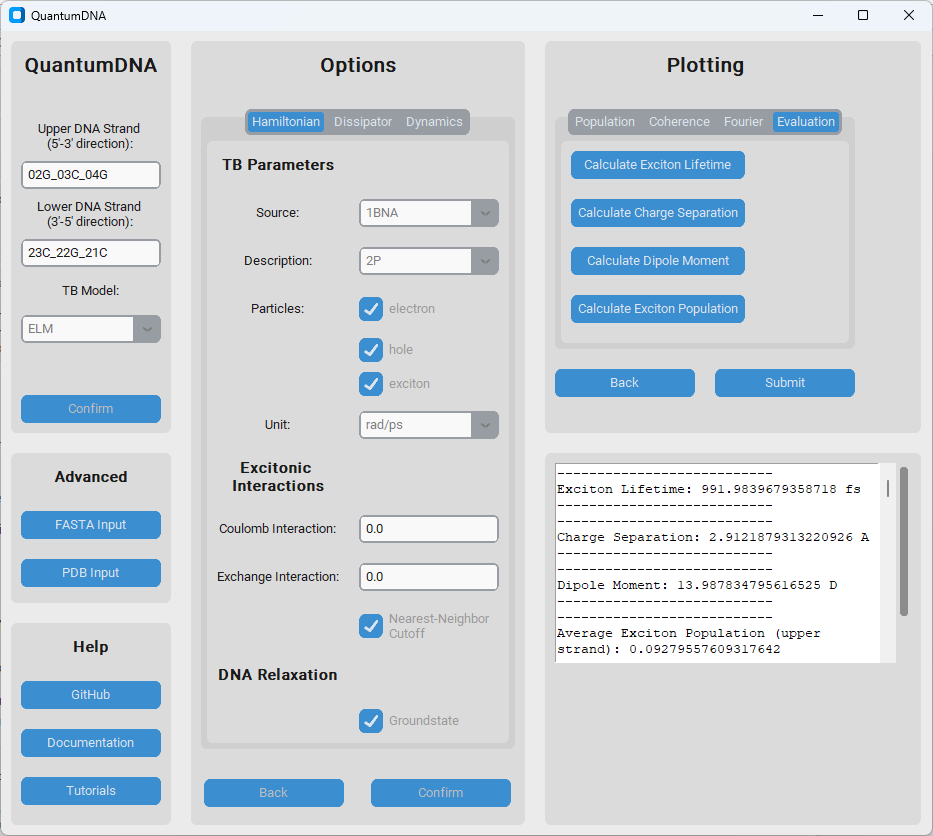

.. _guidoc:

*****************
GUI documentation
*****************

This chapter contains documentation for the graphical user interface (GUI) of QuantumDNA.
The GUI is designed to provide an intuitive and user-friendly way to interact with the QuantumDNA package,
allowing users to visualize and analyze DNA charge transfer and excited states without needing extensive programming knowledge.

.. figure:: ../figures/5_GUI.png
   :align: center
   :alt: Graphical User Interface (GUI).

   Graphical User Interface (GUI).

.. figure:: ../figures/1BNA_2.png
   :align: center
   :width: 60%
   :alt: Plot obtained after pressing the submit button on the menu.

   Plot obtained after pressing the submit button on the menu.

   Screenshot of the menu of the user interface with calculations of the exciton lifetime, average charge separation and dipole moment displayed in the frame on the bottom right.
