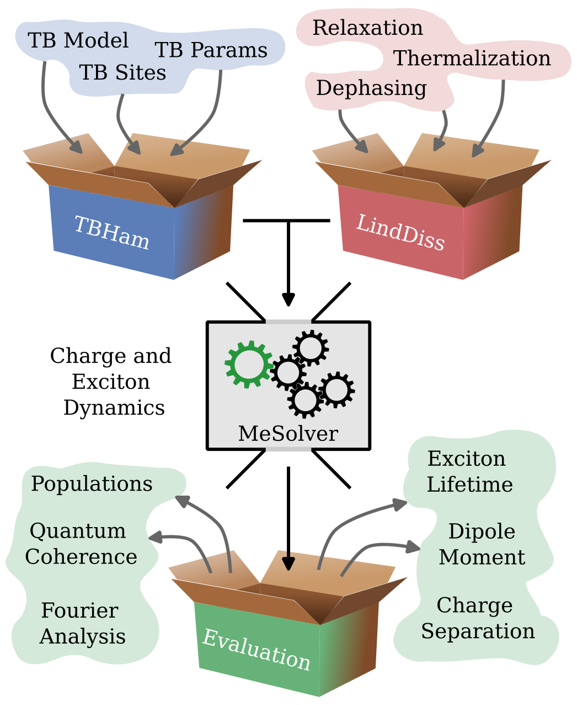

.. figure:: figures/0_qDNA_logo.png
   :align: center
   :width: 6in

Welcome to QuantumDNA's Documentation!
======================================

QuantumDNA is an open-source Python package for simulating charge transfer and excited states in DNA. These processes are key to understanding how DNA maintains genetic stability, how mutations occur, and even how we can use DNA in nanotechnology. QuantumDNA combines powerful quantum physics models like Linear Combination of Atomic Orbitals (LCAO) and tight-binding (TB) with quantum master equations to handle environmental effects. This makes it possible to analyze large DNA datasets quickly and accurately, uncovering insights into genetic and epigenetic phenomena. QuantumDNA comes with a clean and simple graphical user interface—perfect for researchers and students, even without extensive coding experience.

Whether you're a scientist, student, or just curious, QuantumDNA is here to help you explore the fascinating world of DNA charge transfer. Dive in and start exploring today!

About This Documentation
------------------------
This documentation includes:

- **API Reference**: Description on QuantumDNA's functions and classes.
- **User Guide**: Tutorials and instructions for getting started and using QuantumDNA effectively.

For additional resources and development information, visit the `QuantumDNA GitHub repository <https://github.com/dehe1011/QuantumDNA>`_. For hands-on learning, check out the `Tutorial Notebook GitHub repository <https://github.com/dehe1011/QuantumDNA-notebooks>`_, which contains examples and guided exercises.

.. toctree::
   :maxdepth: 2
   :caption: Contents:

   installation
   apidoc/apidoc
   guide/guide
   biblio
   copyright

Indices and tables
==================

* :ref:`genindex`
* :ref:`modindex`
* :ref:`search`
